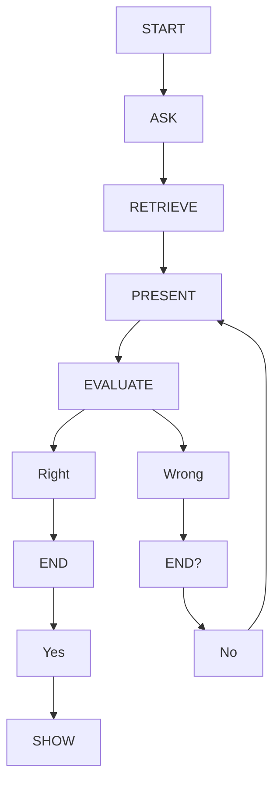

# **Idea: Memorization game for Periodic Table**

### Purpose: Develop a memorization game for periodic table elements. This will aid students trying to memorize the name, atomic number, and group that certain elements belong to.

### Flowchart:

* START: Start program
* ASK: Ask user which groups to use
* RETRIEVE: Retrieve chosen elements
* PRESENT: Present an Element block and ask user for answers
* EVALUATE: Check answers\
  --> If correct, insert the letter where it belongs\
  --> If not, then use an X instead
* END? Check if all the elements have been presented
* SHOW: Show results of the match

    
Click to expand Flowchart

