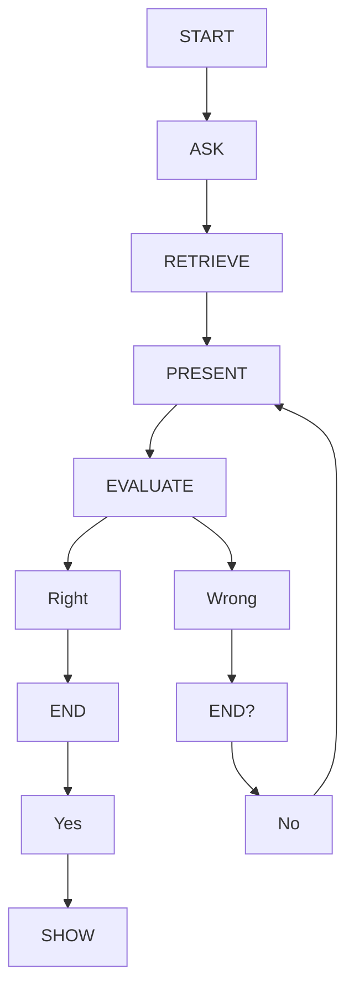

# **Idea: Memorization game for Periodic Table**

## Ever got asked to memorize the elements on a periodic table, and are tired of the browser sites having waaaay to many ads??
WELL, this simple terminal game can definitely help!
Just tell it what groups you'd like to use and watch as you slowly fill out your Periodic Table!

### Flowchart:

* START: Start program
* ASK: Ask user which groups to use
* RETRIEVE: Retrieve chosen elements
* PRESENT: Present an Element block and ask user for answers
* EVALUATE: Check answers\
  --> If correct, insert the letter where it belongs\
  --> If not, then use an X instead
* END? Check if all the elements have been presented
* SHOW: Show results of the match

    
Click to expand Flowchart

